# 🕒 ClockIn

ClockIn is a comprehensive employee time-tracking and management solution. This platform helps businesses streamline attendance, work hours, and employee activity while offering an intuitive interface for admins to manage their teams effectively.
## 👾 Team Members

- Panuphong Burakitphachai (6410521)
- Nitipoom Aumpitak (6420061)
- Phawat Thanajiranon (6413056)

## 🚀 Features

### User (Employee)

- ⏲️ Clock In/Out: Log work hours with a simple clock-in and clock-out system. Include notes and location tracking.
- 📊 Work History: View detailed history of logged hours and work sessions.
- 📝 Request Leave or OT: Submit requests for leave or overtime directly through the app.
- 🔔 Notifications: Receive notifications for clock-ins and other activities via Line Notify.

### Company (Manager/HR)

- 🗃️ Dashboard Overview: Access an overview dashboard for a summary of company-wide attendance, employee activity, and other key metrics.
- 📅 View Employee Attendance: Track the work hours and attendance of all employees in real-time.
- 🛠️ Manage Employees: Add, edit, or remove employee entries. Includes managing employee details, such as contact information, roles, and salary.
- 🔄 Approve/Reject Time Leave or OT Requests: Review and manage employee requests for leave or overtime, taking appropriate action.
- 📈 Reports: Generate detailed reports on employee attendance, hours worked, and other statistics for payroll and performance tracking.
- 📦 Manage Packages: View and manage subscription plans for the company, including registration for new packages and managing trial status.

## 🗂️ Data Models

| Model                | Attributes                                                                                  |
|----------------------|---------------------------------------------------------------------------------------------|
| **Company**          | `id`, `name`, `email`, `password`, `app_password`, `line_token`, `status`, `is_trial`, `stripe_customer_id`, `stripe_subscription_id`, `permissions`, `created_at` |
| **Employee**         | `id`, `company_id`, `email`, `name`, `phone`, `role`, `start_time`, `stop_time`, `status`, `salary`, `off_days`, `is_trial`, `created_at` |
| **Clock**            | `id`, `date_time`, `employee_id`, `status`, `note`, `location`, `created_at`              |
| **Leave**            | `id`, `employee_id`, `leave_type`, `from`, `to`, `status`, `note`, `created_at`           |
| **Overtime**         | `id`, `employee_id`, `date`, `from`, `to`, `status`, `note`, `created_at`                 |

## 📸 Screenshots

### User (Employee)

#### Clock In/Out

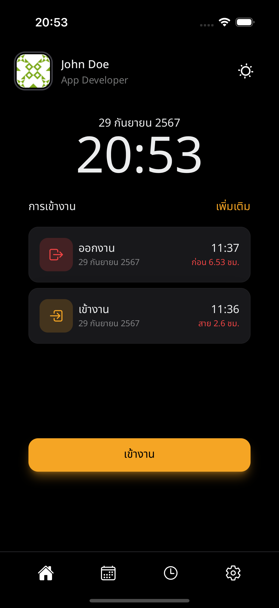

#### Day off

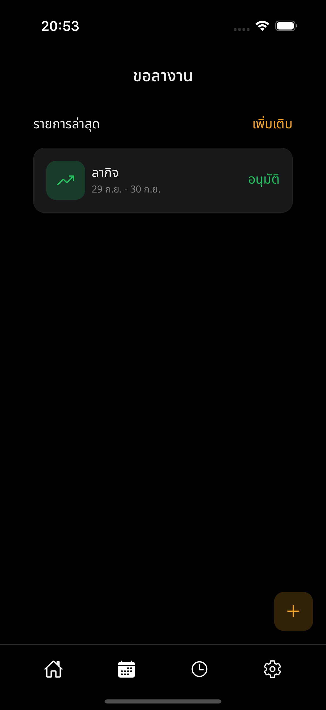

#### Overtime

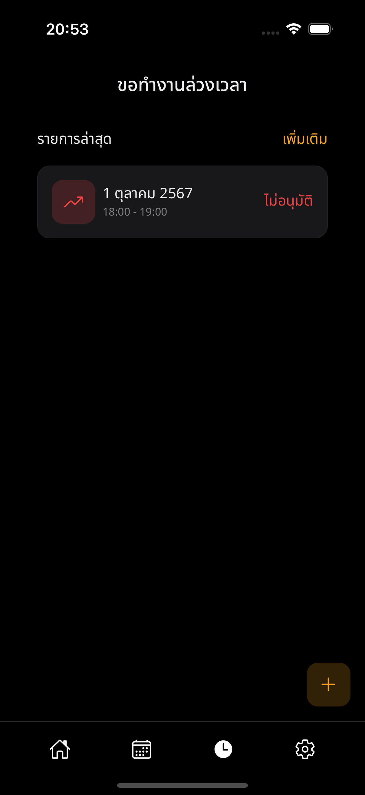

#### Settings


### Admin (Manager/Owner)

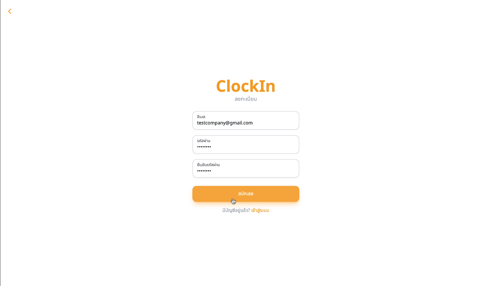

### Package

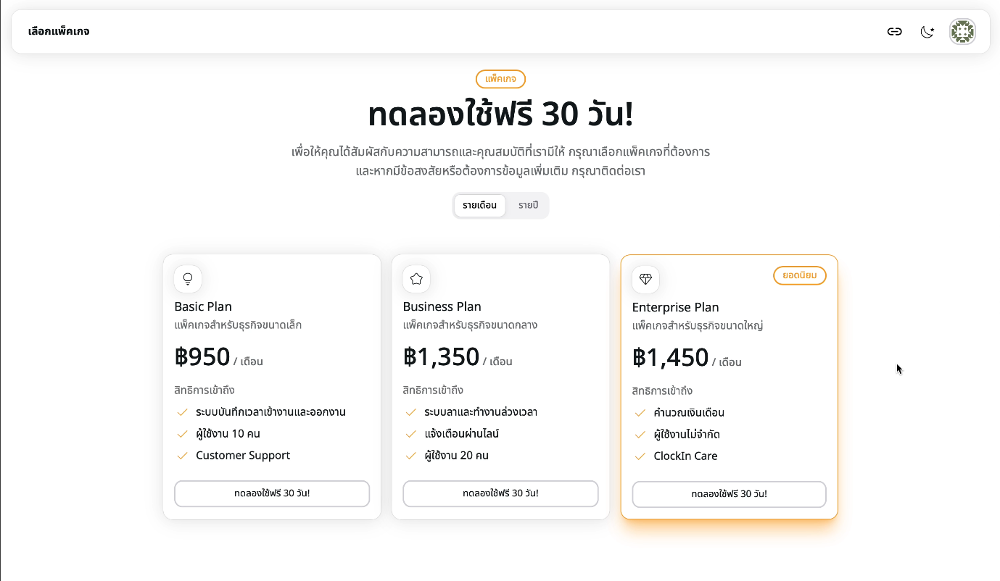

#### Dashboard Overview

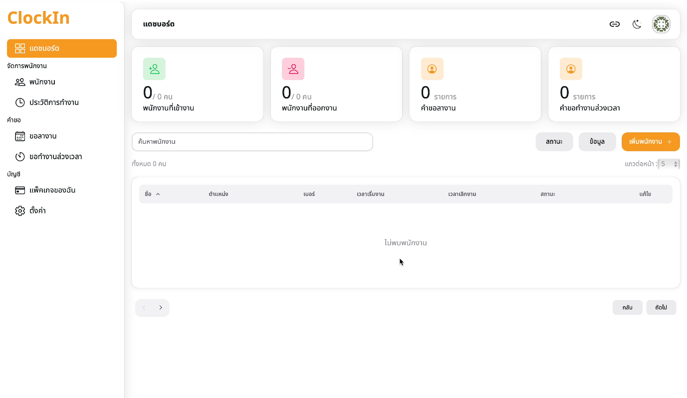

### Add Employee

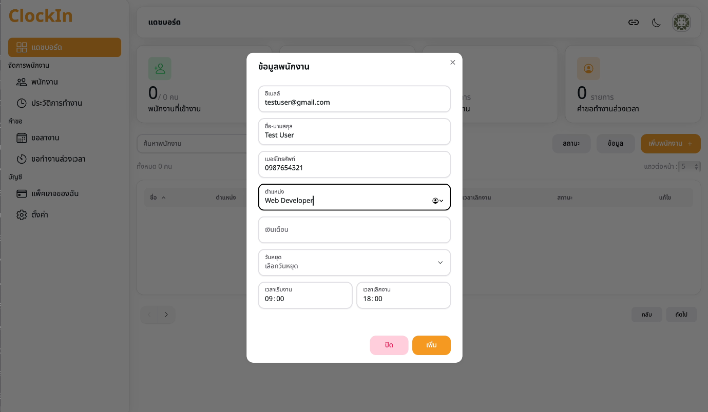

#### Manage Employees

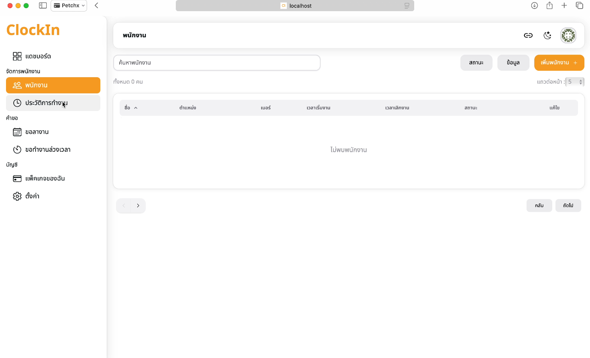

#### Report

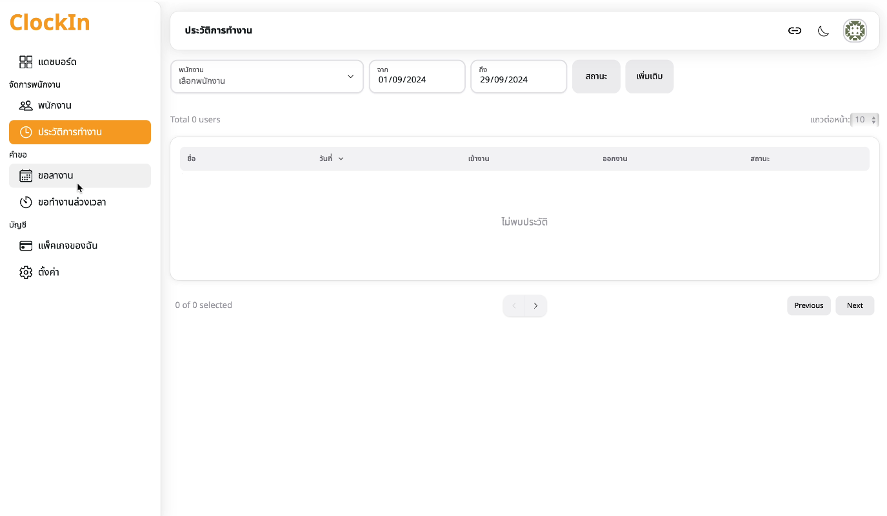

#### Day Off

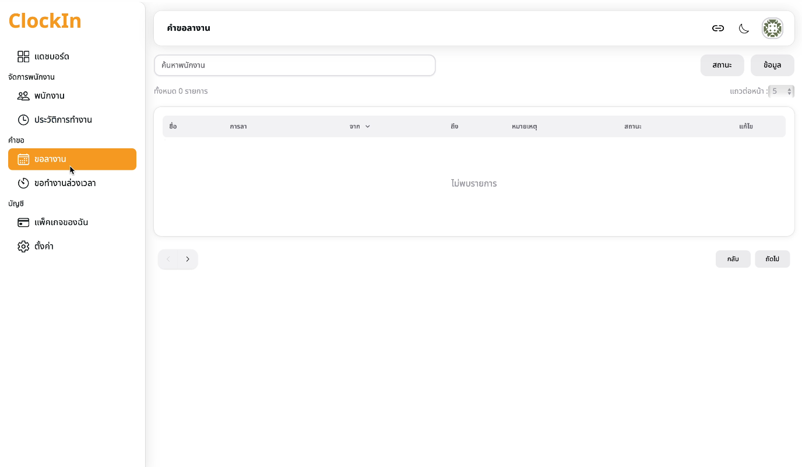

#### Overtime

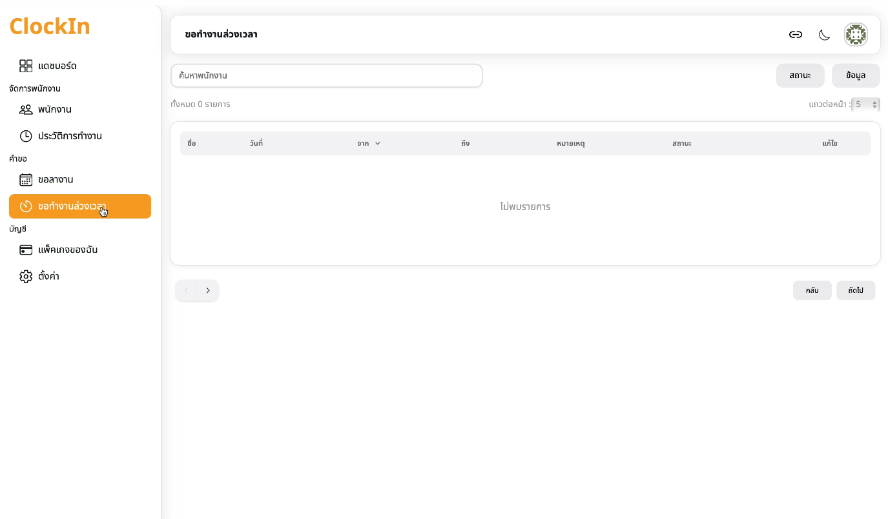


## Video Demo

[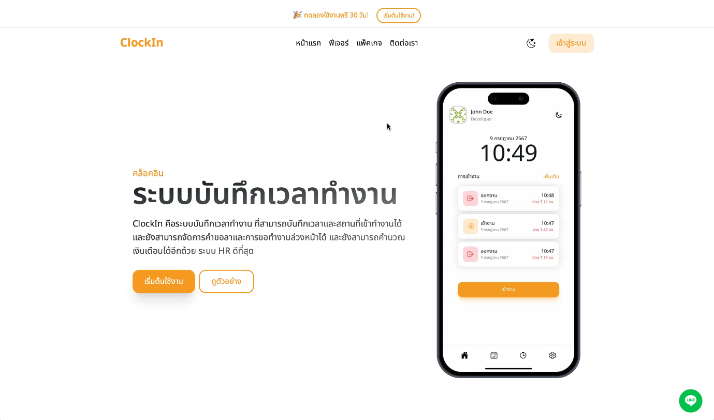](https://youtu.be/K1wbP-nqTNo)

## 🛠️ Getting Started

1. **Clone the repository**:
   ```bash
   git clone https://github.com/petchxx/clockin.git
   ```
2. **Install dependencies**:
   ```bash
   npm install
   ```
3. **Set up the environment variables**:
   Create a `.env` file in the root directory and add the necessary environment variables for your database, API keys, etc.
5. **Run the development server**:
   ```bash
   npm run dev
   ```
6. **Access the application**:
   Open your browser and go to `http://localhost:3000`.

